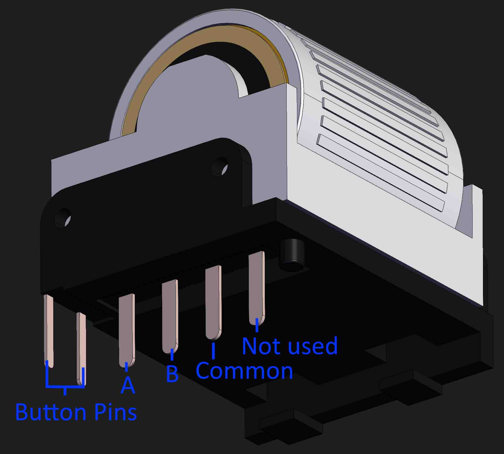
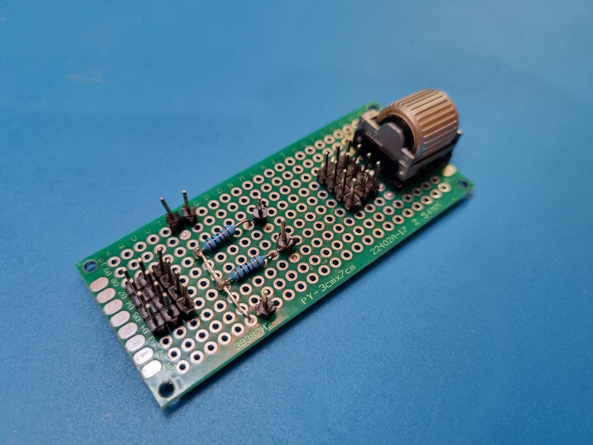
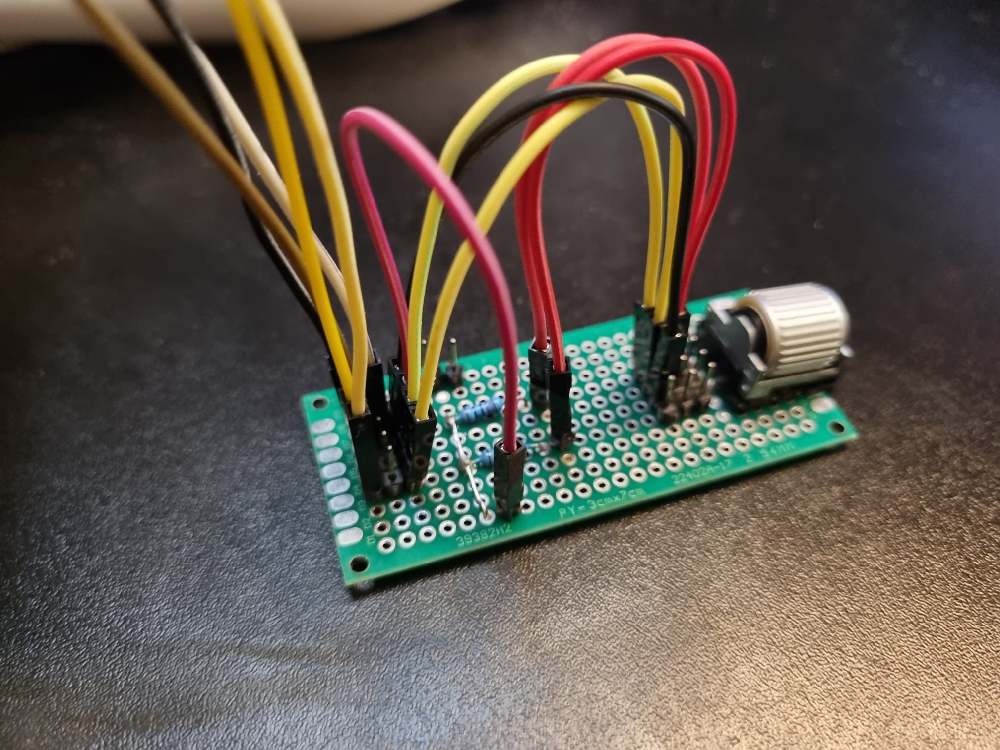
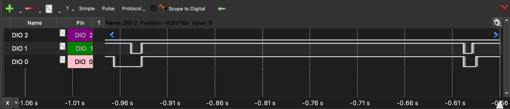
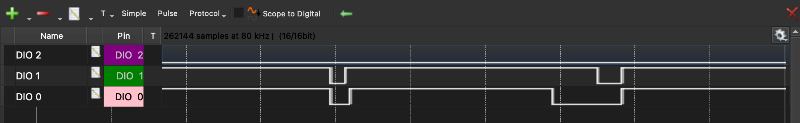
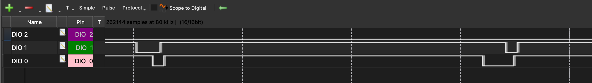
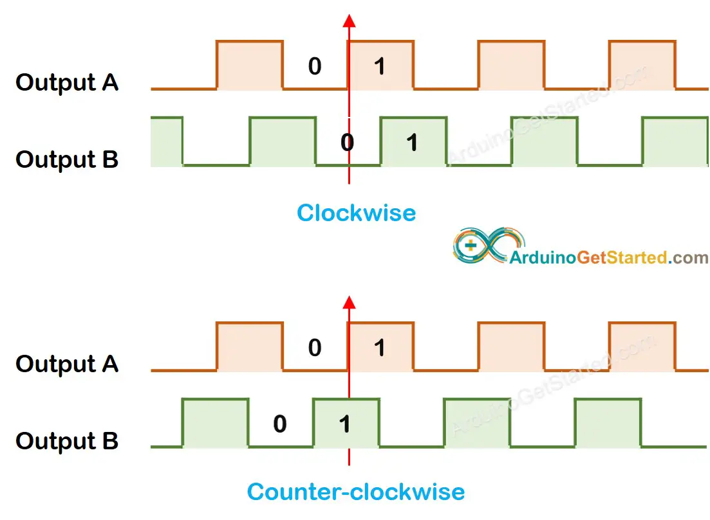
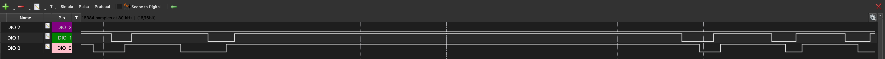

# EVQWGD001 Rotary Encoder Pinout

> [!NOTE]
> Most vendors provide incorrect documentation for the EVQWGD001, and as a result a lot of examples and projects have it wrong. However, even if it's wired "wrong" it will still work fine, as most encoder libraries are able to interpret the "incorrect" signals just fine. 

TL;DR, this is the correct pinout:

Continue reading if you want to know how this can be verified, or why it still works fine if you wired it wrong. 

## Context

I wanted to use a EVQWGD001 rotary encoder in a project. However, it was not very clear how to use it. When searching for information I found conflicting info.

* [https://teletype.in/@gleb.sexy/big-l](https://teletype.in/@gleb.sexy/big-l)
* [https://hackaday.io/page/11326-drawing-again](https://hackaday.io/page/11326-drawing-again)
* AliExpress vendor pages
* ...

I encountered different documentation, each with a order of the pins, and even on the vendor page on AliExpress it would have two different pinouts in the same product description. 

Even when looking at existing projects (e.g. custom keyboard PCBs), I would find them wired up in different ways. 

This left me with quite some questions:

* **Question 1** (Q1): What is the correct pinout of the EVQWGD001 rotary encoder?
* **Question 2** (Q2): How come people are using different wiring, yet it seems to work fine either way?

## Q1: What is the correct pinout of the EVQWGD001? 

### Setup

The goal of the experiment is to use an oscilloscope (Analog Discovery 3) to visualise the three relevant pins, try different combinations, and figure out the correct pinout. 

As the pins of the EVQWGD001 didn't play well with breadboards and dupont cables, I built a quick and dirty jig to hold the EVQWGD001. It also allowed me to easily rewire the pins and connect the oscilloscope to various points in the circuit. 

To keep things simple I wanted to avoid using a microcontroller, so I added two pull-up resistors that simulate the microcontroller pins with internal pull-ups.

### Measurements

I was then able to wire and visualise the various possible pinouts. Basically, either the first pin is the common pin, the second pin is the common pin or the third pin is the common pin. The remaining two pins are always assumed to be channel A and B. 

For each of these three scenarios, I made a small recording on the oscilloscope, which contained one scroll up and one scroll down. This is what it looks like for each scenario.

Assumption: the first pin is the common pin

Assumption: the second pin is the common pin

Assumption: the third pin is the common pin

### Pinout Conclusion

As you can see, in the first two scenarios where we assume either the first or second pin is the common pin, it doesn't look like the signal one would expect from a rotary encoder. One of the channel's square waves is always aligned with the start or end of the other channel's square waves. 

However, they are supposed to overlap, like this (source: [ArduinoGetStarted.com](https://arduinogetstarted.com/tutorials/arduino-rotary-encoder):

We only saw similar results in scenario 3, where we assumed that the third pin is the common pin:

Thus, we can conclude that the third pin is the common pin, and the first and second pins are the "A" and "B" channel respectively. 

## Q2: Why does it still work if you wire it "wrong"

This excellent explanation with interactive simulation has helped to answer this question:

[https://www.pjrc.com/teensy/td_libs_Encoder.html](https://www.pjrc.com/teensy/td_libs_Encoder.html)

Most encoder libraries are implemented as simple state machines, where they monitor the value of the A and B channel. A typical rotation in one direction might look something like this:

|   | A  | B  |
|---|---|---|
| State 1  | 1  | 1  |
| State 2  | 0  | 1  |
| State 3  | 0  | 0  |
| State 4  | 1  | 0  |
| State 1  | 1  | 1  |

And in the other direction it might look like this:

|   | A  | B  |
|---|---|---|
| State 1  | 1  | 1  |
| State 4  | 1  | 0  |
| State 3  | 0  | 0  |
| State 2  | 0  | 1  |
| State 1  | 1  | 1  |

By tracking the states over time (the order in which they are encountered), the software can determine the direction of the rotation. 

Some examples of how this is implemented in code:

* [https://github.com/qmk/qmk_firmware/blob/master/quantum/encoder.c](https://github.com/qmk/qmk_firmware/blob/master/quantum/encoder.c)
* [https://github.com/mathertel/RotaryEncoder/blob/master/src/RotaryEncoder.cpp](https://github.com/mathertel/RotaryEncoder/blob/master/src/RotaryEncoder.cpp)

As we showed in the oscilloscope output, if the EVQWGD001 is wired wrong, the starting or ending edges of the waves align, and the fall or rise happens simultaneously. However, this is not a big problem for software that uses the state machine approach. Concretely, this just means that one of the states in the example table above is skipped if it's wired wrong, but the other states provide enough information to correctly determine the direction of the rotation. 

To explain in other words, even if the square waves align on one side, one wave will still be earlier or later than the other on the other side of the wave. Based on this information, it's clear in which order the A and B channels are being triggered, and in which direction the wheel is turning.

In summary, the rotary encoder is usable no matter which of the first three pins is chosen as the common pin. While it might be technically incorrect and produce different signals, it does work fine in practise due to how the software is typically implemented. 
 
## Sources

* [https://howtomechatronics.com/tutorials/arduino/rotary-encoder-works-use-arduino/](https://howtomechatronics.com/tutorials/arduino/rotary-encoder-works-use-arduino/)
* [https://www.mathertel.de/Arduino/RotaryEncoderLibrary.aspx](https://www.mathertel.de/Arduino/RotaryEncoderLibrary.aspx)
* [https://circuitdigest.com/microcontroller-projects/rotary-encoder-module-interfacing-with-arduino](https://circuitdigest.com/microcontroller-projects/rotary-encoder-module-interfacing-with-arduino)
* [https://arduinogetstarted.com/tutorials/arduino-rotary-encoder](https://arduinogetstarted.com/tutorials/arduino-rotary-encoder)
